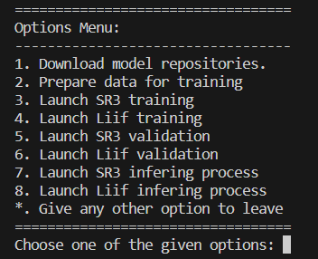

# SUPER RESOLUTION: Going from high to very high resolutions

This is the code repository related to **Ruben Moyas**'s MSc in Data Science Master's Thesis.

This repository contains Python code for automating the downloading and setup of two state-of-the-art super-resolution models. It streamlines the data preparation, model configuration, training, validation, and inference phases for high-quality image super-resolution tasks.

This code and its directory system will give an structure and a set of configuration files and scripts ready to be used in order to train, validate and test the following models:

  - [LIIF](https://github.com/yinboc/liif)
  - [SR3](https://github.com/Janspiry/Image-Super-Resolution-via-Iterative-Refinement)

## Table of Contents
1. [Introduction](#introduction)
2. [Getting Started](#getting-started)
    1. [Prerequisites](#prerequisites)
    2. [Installation](#installation)
3. [Usage](#usage)
4. [Structure of the Repository](#structure-of-the-repository)
5. [Contributing](#contributing)
6. [License](#license)
7. [Acknowledgements](#acknowledgements)
8. [Credits](#credits)

## Introduction
Super-resolution is a class of techniques used in image processing that enhances the resolution of an image. The LIIF and SR3 models are cutting-edge models that use deep learning to achieve remarkable results in super-resolution tasks. This project aims to provide an automated pipeline to facilitate the use and experimentation with these models.



## Getting Started
### Prerequisites
- Python 3.7 or higher
- PyTorch 1.6 or higher
- CUDA

### Installation
1. Clone the repository:
    ```
    git clone https://github.com/rmoyav/tfm_super_resolution.git
    ```
2. Navigate to the repository directory:
    ```
    cd tfm_super_resolution
    ```
3. Install the required dependencies:
    ```
    pip install -r requirements.txt
    ```

## Usage
1. Download the dataset and unzip it in a 'data' folder under repository directory:
   To download the dataset that will be used during the training, validation, and testing of the models, please go to the following URL [UC Merced Land Use Dataset](http://weegee.vision.ucmerced.edu/datasets/landuse.html) and follow the indicated steps. Once you have downloaded the compressed folder with the data, please create a 'data' folder in the root of this repository and extract the contents of the downloaded file inside it.
2. Run the `main.py` script:
    ```
    python ./tools/main.py
    ```
3. Follow the on-screen instructions to choose from the various options, such as downloading the models, preparing the data, configuring the models, and running training, validation, or inference.

## Structure of the Repository (before and after the main script has been used)
- `data/`: Contains the data used for training and validation.
- `liif_script/`: Contains the custom infer script for the **liif** model
- `model_config/`: Contains the data used for training and validation.
- `models/`: Contains the **liif** and **SR3** model repositories.
- `tools/`: Contains the code developed for this project.
- `tools/main.py`: Main script that automates the entire pipeline through a user-friendly menu.

## Contributing
Contributions to this repository will be welcome once the Master's Thesis has been published and defended. Please open an issue to discuss the change or improvement before making a pull request.

## License
This project is licensed under the Creative Commons CC0 1.0 Universal license. See the [LICENSE](LICENSE) file for details.

## Acknowledgements
I would like to express my gratitude to my advisors and the [Universitat Oberta de Catalunya](https://www.uoc.edu/) for their support throughout the development of this project. I also want to acknowledge the original authors and contributors of the LIIF and SR3 models.

## Credits
Author: *Rubén Moya* [rmoyav@uoc.edu](mailto:rmoyav@uoc.edu)
